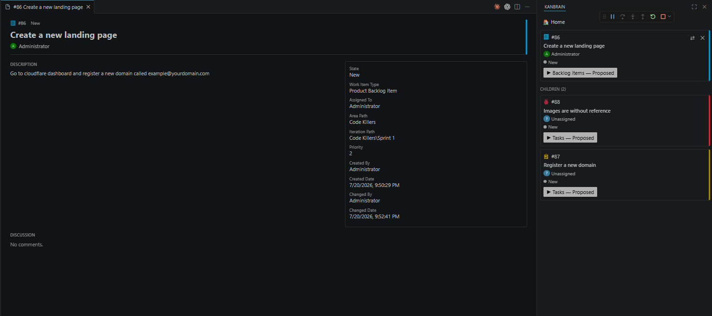

# Kanbrain

VS Code extension that shows the active Azure DevOps work item and its children in a side panel, with per-status "skill" buttons that generate a context file and send a read command to an integrated terminal.

## Screenshots



## Setup

1. Open a workspace folder.
2. Run **Kanbrain: Setup** from the command palette. Sign in with your Microsoft account when prompted, then pick an Azure DevOps organization and project.
3. Setup reads the project's real backlog levels (Epics/Features/Stories/Tasks, or whatever your process defines) and states from Azure DevOps, then asks whether to generate placeholder skill files automatically for each individual status. This creates `.kanbrain/config.json` (commit it — it's shared team config) and, if you said yes, one skill file per backlog level + status under `.kanbrain/skills/`.
4. Edit the generated skill files and, if needed, `.kanbrain/config.json`'s `backlogLevels` map (`{ [backlogLevel]: { [status]: skillEntryOrNull } }`) to fine-tune which skill runs for which status.

   Each `backlogLevels[level][status]` entry is either `null` (no action for that status) or an object with a required `path` (relative to the workspace root) and three optional fields: `label` (overrides the button text — defaults to the skill file's name), `textColor` and `buttonColor` (hex, no `#` needed — override the button's text/background color; an invalid or missing value falls back to the VS Code theme's default button colors). `Kanbrain: Setup` generates entries with all four fields already filled in: `label` is `"Execute {status} skill"`, `buttonColor` is the status's real Azure DevOps color (a neutral gray if none is known), and `textColor` is computed for readable contrast against it — edit any of them by hand (or via the color pickers on the Config screen) to customize further. `Kanbrain: Sync Board Configuration` only ever adds new entries as `{ "path": ... }` (no auto-filled label/colors), since it's meant to be a light touch that never surprises you with visual changes to entries it didn't create.

   `statusColors` maps each status name to the hex color Azure DevOps assigns it (shown as a small dot next to the status text). `typeColors` colors the right border of each work item card, and `typeIcons` holds the real work item type icon as inline SVG markup shown next to the `#id` — both fetched and sanitized during Setup. All three are captured automatically during Setup — projects configured before these fields existed need to re-run **Kanbrain: Setup** to get colors/icons.

5. Run **Kanbrain: Select Work Item** to pick which work item shows in the panel. Drag the "Kanbrain" view (from the activity bar) into the secondary sidebar if you want it on the right, like the backoffice flow mode.

If a teammate already ran Setup and committed `.kanbrain/config.json`, cloning the repo and opening it in VS Code won't automatically connect with *your* Azure DevOps identity. The panel detects this — a project that's configured but not yet connected on this machine shows a prompt to run **Kanbrain: Connect to Azure DevOps** (also available directly as a command), which lets you pick which Microsoft account to use (even if VS Code already has one cached for something else) and confirms it actually has access to the configured organization/project before returning you to the normal panel.

If the project's process changes later (a status is renamed, a work item type is added/removed, a type moves to a different backlog level), run **Kanbrain: Check Board Configuration** to see whether `.kanbrain/config.json` is still in sync — it never modifies anything by itself. If it finds a difference, it offers a **Sync Now** action (also available directly as **Kanbrain: Sync Board Configuration**) that refreshes colors/icons/type mappings and adds any new statuses, but never deletes a skill mapping you've configured — entries for statuses/levels no longer found on the board are kept as-is so you don't lose your work; the command's summary tells you which ones to review. Kanbrain also runs this check once, silently, each time the panel first opens in a VS Code session, and only shows a message if something needs your attention.

If you're not sure how to map the project's real process onto Kanbrain — especially if the team thinks in terms of board columns rather than raw statuses — run **Kanbrain: Configure with AI** (also available as a button on the Home screen). It reads the project's real backlog levels/types/statuses *and* board columns, writes a context file explaining the difference between the two, and hands it to the agent in the integrated terminal, which asks how you want it to work and then edits `.kanbrain/config.json`/`.kanbrain/skills/*.md` for you (and, only if you ask it to, reconfigures the real Azure DevOps board using its own tools — Kanbrain itself never writes to Azure DevOps).

The panel has three screens. **Home** — shown by default when there's no active work item, or after clicking **🏠 Home** from either other screen — has up to four sections, in order: **Flow** (with an active item, its card — without the skill action button — plus small ⇄/✕ icon buttons in the card's top-right corner for Switch/Clear, and an "Open Flow →" button; without an active item, a single "Select Work Item" button that opens the same floating search dialog used elsewhere), **Team** (a card-styled dropdown to pick which team's card settings to use as a tie-break, shown whenever at least one team is discovered), **Commands** (Setup, Check Board Configuration, Sync Board Configuration, Configure with AI), and **Configuration** (a single button leading to the Config screen). **Flow** (reached by picking a work item, or "Open Flow →" from Home) is the card + children view described above, including the skill action button, with a "🏠 Home" button (and the same ⇄/✕ icon buttons on the card) added to its (sticky) header. **Config** (reached via the "Configuration" button/section on Home) shows the skill configuration editor under its own sticky header: one editable row per work item type/status, with a path field, a "…" button to browse for the skill file, a label field, and text color/button color fields each paired with a native color picker — changes save automatically when you leave a field or pick a color. The editor only edits these values; it doesn't add or remove work item types or statuses — that stays the job of Setup/Sync.

## Skill file placeholders

`{{id}}` `{{title}}` `{{description}}` `{{status}}` `{{type}}` `{{url}}` `{{branch}}` `{{parent.id}}` `{{parent.title}}` `{{parent.description}}` `{{subtasks}}`

## Development

```bash
npm install
npm run compile
npm run test:unit
npm run test:integration
```

Press F5 in VS Code to launch an Extension Development Host with Kanbrain loaded.

> **Note:** `npm run test:integration` launches a real VS Code instance via `@vscode/test-electron`. On Windows, that tool spawns the Code binary through a shell without escaping arguments, so it can fail with `Cannot find module 'C:\Users\...\Área'`-style errors if the repository path contains a space (a known upstream limitation, not a bug in this extension). If that happens in your environment, use the manual verification checklist below instead, or move/clone the repo to a space-free path before running that script.

## Manual verification checklist

Run these by hand in an Extension Development Host (press F5) against a real Azure DevOps organization, since the webview UI and the live auth/API flow aren't covered by either test suite:

- [ ] `Kanbrain: Setup` prompts for Microsoft login, lists real organizations, lists real projects, and writes `.kanbrain/config.json`.
- [ ] `.kanbrain/generated/` is added to `.gitignore` after setup.
- [ ] With a valid `.kanbrain/config.json` already present (e.g. after cloning a teammate's setup) but no Azure DevOps session/access established on this machine yet, the panel shows a "not connected" prompt with a button to run `Kanbrain: Connect to Azure DevOps`, instead of a blank or stuck panel.
- [ ] Running `Kanbrain: Connect to Azure DevOps` always prompts to pick a Microsoft account, even if VS Code already has one cached for another purpose; on success it shows "Connected to `<org>`/`<project>`." and the panel returns to the normal Home screen.
- [ ] Picking a Microsoft account that has no access to the configured organization/project shows a clear inline error message (not a silent failure or hang), and the panel stays on the "not connected" prompt.
- [ ] Running `Kanbrain: Connect to Azure DevOps` before `.kanbrain/config.json` exists shows an inline error ("No project configured. Run Kanbrain: Setup.") instead of failing silently.
- [ ] `Kanbrain: Setup`, after picking a project, asks whether to generate placeholder skill files per backlog level/status, and writes `backlogLevels`/`typeToBacklogLevel` reflecting the project's real process either way.
- [ ] Answering "Yes" creates one skill file per backlog level + status under `.kanbrain/skills/`, and `Done`/`Removed`-category statuses map to `null`.
- [ ] `Kanbrain: Select Work Item` search returns matching work items by title and by `#id`.
- [ ] With no active work item, the panel shows a search box and, without typing anything, a list of up to 50 recent work items grouped by status.
- [ ] Typing in the search box filters the list by title or `#id`.
- [ ] Clicking a result in the list sets it as the active work item and persists the selection (survives a window reload).
- [ ] With an active work item, the header shows a "🔍 Switch work item" button that opens the search as a floating dialog over the current card, without pushing it down the page.
- [ ] The search dialog closes via the "✕" button in its header or by clicking the darkened backdrop outside it, without changing the active work item.
- [ ] If the search request fails (e.g. token expired), the results area shows an inline error message instead of hanging or throwing.
- [ ] Typing a number in the search box (e.g. `88`) matches work items whose id contains those digits (e.g. `88` and `880`), not just an exact id match.
- [ ] Each status section in the search results can be collapsed/expanded by clicking its header, independently of the others.
- [ ] Each work item in the search results list shows the real Azure DevOps type icon and a colored right border matching that type's color, without a status dot or action button on the item itself.
- [ ] The search dialog shows an "All" tab plus one tab per backlog level, in the project's real backlog order; clicking a tab filters the already-visible list instantly, with no loading delay.
- [ ] Each backlog level tab's count reflects the total number of that type of work item in the whole project (not just how many match the current search text), and only changes when the dialog is reopened or cleared — not while typing.
- [ ] A backlog level tab with 0 items in the project stays visible (dimmed), and clicking it shows the "No work items found." message.
- [ ] The header shows a "✕ Clear" button next to "🔍 Switch work item" that clears the active work item and returns to the empty/search state.
- [ ] Each work item card shows the real Azure DevOps type icon next to its `#id`, and a colored right border matching that type's color.
- [ ] The status is shown as a small colored dot next to the plain status text (main card, children, and search result group headers) — not a filled badge.
- [ ] Selecting a work item renders it in the Kanbrain view with correct status dot, type icon/border, and title.
- [ ] Children (Parent/Child linked work items) render under "Children (N)".
- [ ] A status with a configured skill shows an action button; a status without one does not.
- [ ] A skill entry with a custom `label` shows that text on the action button instead of the skill file's name; a valid `textColor`/`buttonColor` is applied to the button, and an invalid or missing one falls back to the theme's default button colors.
- [ ] With no active work item, the panel shows the Home screen (Flow / Commands / Configuration sections, in that order) instead of a bare search box; the Flow section shows a single "Select Work Item" button rather than an embedded list.
- [ ] Clicking "Select Work Item" on Home opens the same floating search dialog used by "Switch work item" elsewhere; picking a result navigates to the Flow screen (card + children).
- [ ] Clicking Setup, Check Board Configuration, or Sync Board Configuration on Home runs the corresponding command; clicking Configuration navigates to the Config screen.
- [ ] With an active work item, clicking "🏠 Home" shows the Home screen with that item's card in the Flow section (no skill action button on it there), with small 🔍/✕ icon buttons in the card's top-right corner for Switch/Clear, without clearing the active work item; clicking "Open Flow →" returns to the Flow screen (which does show the skill action button).
- [ ] The Config screen shows a "🏠 Home" button and the skill configuration editor, with no Commands or Current Work Item content.
- [ ] Editing a skill's path, label, text color, or button color on the Config screen and moving focus away (Tab or click elsewhere) persists the change to `.kanbrain/config.json` without a Save button; reopening Config shows the saved value.
- [ ] Picking a color with the native color picker next to a text/button color field updates the hex text field and saves immediately, without needing to move focus away.
- [ ] After running `Kanbrain: Setup` with placeholder skill file generation enabled, the Config screen shows each generated entry already filled in with a label (`"Execute {status} skill"`), a `buttonColor` matching that status's real color from Azure DevOps, and a `textColor` that reads clearly against it (not the same color as the background).
- [ ] Clicking the "…" button next to a skill's path field opens a native file picker; choosing a `.md` file inside the workspace fills the path field with the relative path and saves it.
- [ ] Clearing a skill's path field and moving focus away sets that status back to no skill (`null`) — the action button disappears from that status's card.
- [ ] The Home, Flow, and Config screens' navigation/command buttons (Home, Open Flow, Setup, Check/Sync Board Configuration, Configuration) all use the same muted secondary button style, not the accent/primary color; Home's Switch/Clear are the small 🔍/✕ icon buttons on the card instead.
- [ ] The Flow and Config screens' headers stay visible (sticky) at the top when their content is tall enough to scroll; Home's own layout is unaffected by this.
- [ ] Clicking the action button opens/reuses a "Kanbrain" terminal and sends `Read the file .kanbrain/generated/<id>-<timestamp>.md and follow the instructions in it.`
- [ ] The generated file's placeholders are correctly resolved with real work item data.
- [ ] Changing the work item's status directly in Azure DevOps Boards is reflected in the panel within ~5 seconds (polling).
- [ ] Reopening the workspace restores the previously selected work item (via `workspaceState`).
- [ ] `Kanbrain: Check Board Configuration` reports "up to date" when the board hasn't changed since Setup, and never writes to `.kanbrain/config.json`.
- [ ] After renaming/adding/removing a status or work item type on the real Azure DevOps board, `Kanbrain: Check Board Configuration` reports the specific difference, and its "Sync Now" action (or running `Kanbrain: Sync Board Configuration` directly) updates `.kanbrain/config.json` without deleting any existing skill path mapping — including ones for statuses no longer found on the board.
- [ ] `Kanbrain: Configure with AI` (command palette or the Home screen's "🤖 Configure with AI" button) opens/reuses the "Kanbrain" terminal and sends a read command for a new `.kanbrain/generated/setup-assistant-<timestamp>.md` file.
- [ ] That generated file lists the project's real backlog levels, work item types, and statuses (with categories), and, separately, the team's real boards and columns (with each column's state mappings by work item type) — or a "No boards were found" note if the team has none.
- [ ] Running `Kanbrain: Configure with AI` before `Kanbrain: Setup` has created `.kanbrain/config.json` shows an inline error ("No project configured. Run Kanbrain: Setup.") instead of failing silently or crashing.
- [ ] Manually editing `.kanbrain/config.json` into invalid JSON causes the panel, search, and skill actions to show a clear "not valid JSON" message (via `Kanbrain: Check Board Configuration`) instead of failing silently or crashing.
- [ ] The board configuration check runs once, silently, the first time the panel opens in a VS Code session — no visible message when everything is in sync.
- [ ] Dragging the Kanbrain view into the secondary/right sidebar works and persists across reloads.
- [ ] After `Kanbrain: Setup`, `.kanbrain/config.json` has a `cardSettingsByBoard` entry for every board the team's process has, each mapping work item types to `{ parent, assignedTo }` (compare against Board Settings > Fields for a couple of types in the real Azure DevOps project — Parent shows as an additional field, AssignedTo as the "Show assigned to" core field).
- [ ] The main Flow card shows a "Parent" label followed by the parent's type icon and "#id: Title" as a clickable link (styled like a native Azure Boards card field) only for a work item type whose board has Parent enabled; a type with Parent disabled (or with no `parent` resolved) shows no such row, and clicking it opens that parent's detail tab without changing the active work item.
- [ ] The assignee row on the main card, subtask cards, and the Home screen's card follows `cardSettingsByBoard`'s `assignedTo` per type — not the "Show assignee in search results" checkbox, which only affects the search dialog's results list.
- [ ] Unchecking "Show assignee in search results" on the Config screen hides assignees only in the floating search dialog; the main/subtask/Home cards are unaffected.
- [ ] When `cardSettingsByBoard` has more than one board, the Config screen shows a board dropdown; picking a different board and reloading the window keeps that same board selected (verifies `workspaceState` persistence), and it never gets written into the committed `.kanbrain/config.json`.
- [ ] A work item with a linked branch shows a "Development" section (branch-fork icon + "Development" label) on its card, listing the branch name — on the main card, every subtask card, and the Home screen's active card.
- [ ] A work item with a linked pull request shows `#id Title (Status)` in the Development section; a work item with no linked branches/PRs shows no Development section at all.
- [ ] If the pull request's title/status fails to load, the Development section still shows that PR's `#id` alone, without breaking the rest of the card.
- [ ] The Development section is never gated by any Config screen setting — it shows the same way regardless of `showAssignedTo`, `cardSettingsByBoard`, or the selected board.
- [ ] After `Kanbrain: Setup`, `.kanbrain/config.json` has a `skills` entry per real work item type (not per backlog level) and a `defaultTeam` matching the project's actual default team.
- [ ] `.kanbrain/config.json`'s `cardSettingsByTeam` has an entry for every team in the project (compare against the real list of teams in Azure DevOps project settings), not just the default team.
- [ ] The Config screen's skill editor groups skills by work item type (e.g. "Epic", "Feature", "User Story", "Bug", "Task"), not by any backlog-level grouping.
- [ ] The search dialog's tabs are one per work item type, not per backlog level — a type like "Bug" that used to share a "Stories" tab with "User Story" now has its own tab.
- [ ] When at least one team is discovered, the Home screen shows a "Team" section styled as a card (matching the active work item card), between Flow and Commands; switching the selected team and reloading the window keeps that same team selected, and it's never written into the committed `.kanbrain/config.json`. It's absent from the Config screen.
- [ ] A work item type visible on one team's board but hidden on another team's board (a real per-team backlog-level visibility difference) still gets a correct `skills` entry — the type is never silently missing just because the default team happens to hide it.
- [ ] `Kanbrain: Check Board Configuration` and `Kanbrain: Sync Board Configuration` report added/removed work item types and statuses correctly after a real process change, with no mention of "backlog level" anywhere in the messages.
- [ ] Work item types with zero real work items in the project (e.g. an unused process default like Impediment) never appear as a search dialog tab or a `skills` entry, even though they're valid, non-disabled types in the process.
- [ ] `.kanbrain/config.json`'s `lastSyncedVersion` matches the installed extension's version after Setup or Sync.
- [ ] Opening a project whose `.kanbrain/config.json` still has the legacy `backlogLevels`/`typeToBacklogLevel` shape (from before 0.2.3) no longer crashes — it's transparently migrated to `skills` in memory the moment it's read, with no network call required.
- [ ] Clicking Setup, Connect, Check Board Configuration, Sync Board Configuration, or Configure with AI shows a spinner on that button (dimmed, disabled) until the command finishes, instead of giving no feedback while the network calls run.
